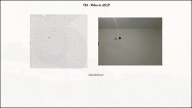

# VTA - Video To Ascii

The idea of this project is to be a simple project that transforms
the webcam image into ASCII format (real-time ascii art).

While doing this project I was aiming to understand how
goroutines and channels works in Go.

## Some warnings

If you, for some reason want to run this project on your machine, there is some warnings:

I am using Ubuntu 22.04 at the time this project is created, I'm not sure about cross-plataform compatibility.
I'm loading the `/dev/video0` video device directly, maybe you need to change that.

## Example

